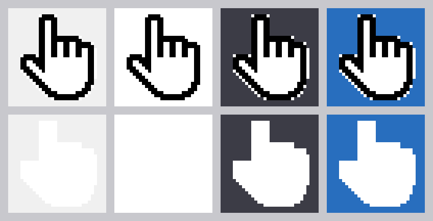

# White hand cursor for a VBA UserForm

`hand-source.png` is the original artwork: black line art whose interior is
transparent, so the hand looks see-through. The files below are the opaque white
versions, generated by `tools/make_hand_cursor.py`.



| File | Look |
| --- | --- |
| `hand-white.cur` | White hand with a black outline (recommended - stays visible on any form colour) |
| `hand-white-solid.cur` | Pure white silhouette, no black at all (disappears on a white form) |
| `hand-white.ico`, `hand-white-solid.ico` | Same images as icons, in case you prefer `.ico` |
| `*-preview.png` | The same pixels as PNG, for previewing |

All of them are 32x32, 24-bit colour plus a 1-bit transparency mask - the classic
cursor layout that `LoadPicture` accepts on every Excel version. The hotspot (the
pixel that actually does the clicking) is the tip of the raised index finger at
12, 2.

The hand itself is fully opaque; only the area *around* the hand is transparent,
which is what lets the cursor keep its hand shape instead of showing as a white
square.

## Using it in Excel VBA

Copy the `.cur` file somewhere stable, then set both `MouseIcon` and
`MousePointer` - the custom icon is ignored unless the pointer is set to 99
(`fmMousePointerCustom`).

```vba
Private Sub UserForm_Initialize()
    Me.MouseIcon = LoadPicture(ThisWorkbook.Path & "\hand-white.cur")
    Me.MousePointer = fmMousePointerCustom
End Sub
```

For a single control, for example a label used as a button:

```vba
Private Sub UserForm_Initialize()
    Label1.MouseIcon = LoadPicture(ThisWorkbook.Path & "\hand-white.cur")
    Label1.MousePointer = fmMousePointerCustom
End Sub
```

Notes:

- `LoadPicture` raises "Invalid picture" if the path is wrong, so keep the file
  next to the workbook or use a fixed folder such as `C:\Icons\`.
- To avoid shipping a separate file, load the cursor once into a hidden
  `Image` control (set its `Picture` at design time) and assign
  `MouseIcon = Image1.Picture` at run time.
- Controls do not inherit the form's `MouseIcon`; set it on each control that
  should show the hand.

## Regenerating

```bash
pip install Pillow
python3 tools/make_hand_cursor.py
```
